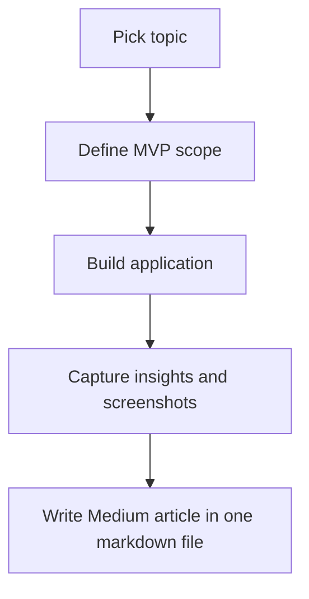

# Workflow Steering File

This document defines a reusable end-to-end workflow for turning an idea into:

1. A selected topic
2. A small MVP application
3. A single markdown file for a Medium article, including Mermaid diagrams

## End-to-End Workflow

### Phase 1: Pick the topics
- **Goal**: Select a topic that is practical, interesting, and suitable for both a demo app and an article.
- **Inputs**:
  - Problem space or theme
  - Target audience
  - Constraints on time, scope, and tech
- **Activities**:
  - Brainstorm 3 to 5 candidate topics
  - Score each topic for usefulness, clarity, novelty, and demo potential
  - Choose one primary topic and optionally one backup topic
  - Define the core lesson the user or reader should learn
- **Outputs**:
  - Chosen topic
  - One-sentence thesis
  - Short outline of the concept to demonstrate
- **Definition of done**:
  - Topic is narrow enough for an MVP
  - Topic has a clear educational or product angle
  - Topic can be explained visually and in code

### Phase 2: Write an MVP application
- **Goal**: Build a lightweight application that proves the concept behind the chosen topic.
- **Inputs**:
  - Selected topic and thesis
  - MVP scope
  - UX and technical constraints
- **Activities**:
  - Define the smallest working user flow
  - Choose the simplest implementation approach
  - Build the core interaction loop
  - Add enough UI and documentation for someone else to run it
  - Capture screenshots, outputs, or examples for the article
- **Outputs**:
  - Working MVP application
  - Source files
  - `README.md` with run instructions
  - Visual artifacts for the article
- **Definition of done**:
  - App runs locally
  - Main concept is visible in one short demo
  - Scope remains intentionally small
  - README explains what it does and how to run it

### Phase 3: Write the Medium article in one markdown file
- **Goal**: Turn the MVP and topic into a Medium-ready article stored in a single markdown file.
- **Inputs**:
  - Final MVP
  - Notes from development
  - Screenshots, diagrams, or demo observations
- **Activities**:
  - Write the article directly in one markdown file
  - Use a strong title, hook, and problem statement
  - Explain the idea, the MVP, and key implementation decisions
  - Include Mermaid code for system or workflow diagrams
  - End with lessons learned, trade-offs, and next steps
- **Outputs**:
  - One article markdown file
  - Embedded Mermaid code blocks
  - Medium-ready structure and formatting
- **Definition of done**:
  - Article stands alone without extra notes
  - Markdown is complete in a single file
  - At least one Mermaid diagram is included
  - Reader can understand both the problem and the MVP outcome

## Standard Deliverables

- Topic selection note
- MVP application code
- `README.md`
- One Medium article markdown file with Mermaid diagrams

## Recommended File Flow

- `STEERING.md` -> project workflow and decisions
- `README.md` -> setup and usage
- `app/` or root app files -> MVP implementation
- `medium-article-*.md` -> final article in one markdown file

## Handoff Rules Between Phases

### From topic selection to MVP
- The chosen topic must have a single clear use case
- The MVP should focus on demonstrating that one use case only

### From MVP to article
- The app becomes the source of truth for examples, screenshots, and technical explanation
- The article should describe what was built, why it matters, and what was learned

## Working Template

### 1. Topic
- What is the topic?
- Why is it worth building?
- What should the reader learn?

### 2. MVP
- What is the smallest usable version?
- What is in scope?
- What is explicitly out of scope?

### 3. Article
- What is the title?
- What is the story arc?
- Which Mermaid diagram best explains the flow?

## Example Mermaid Block

## Status

- This steering file is now generalized for an end-to-end topic -> MVP -> article workflow.

