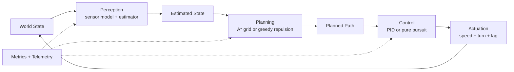
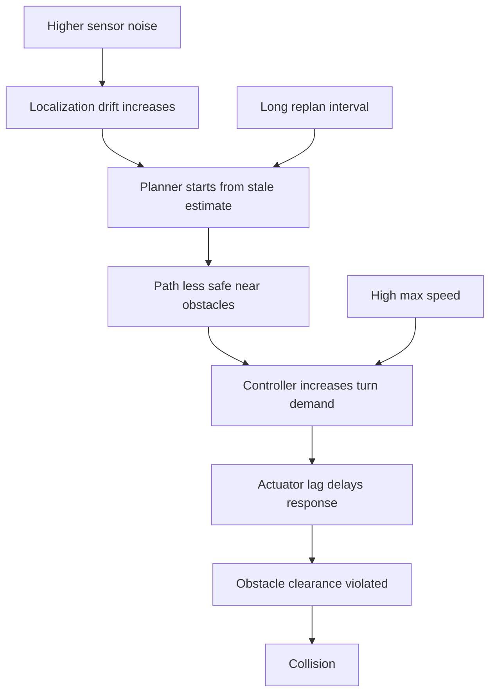
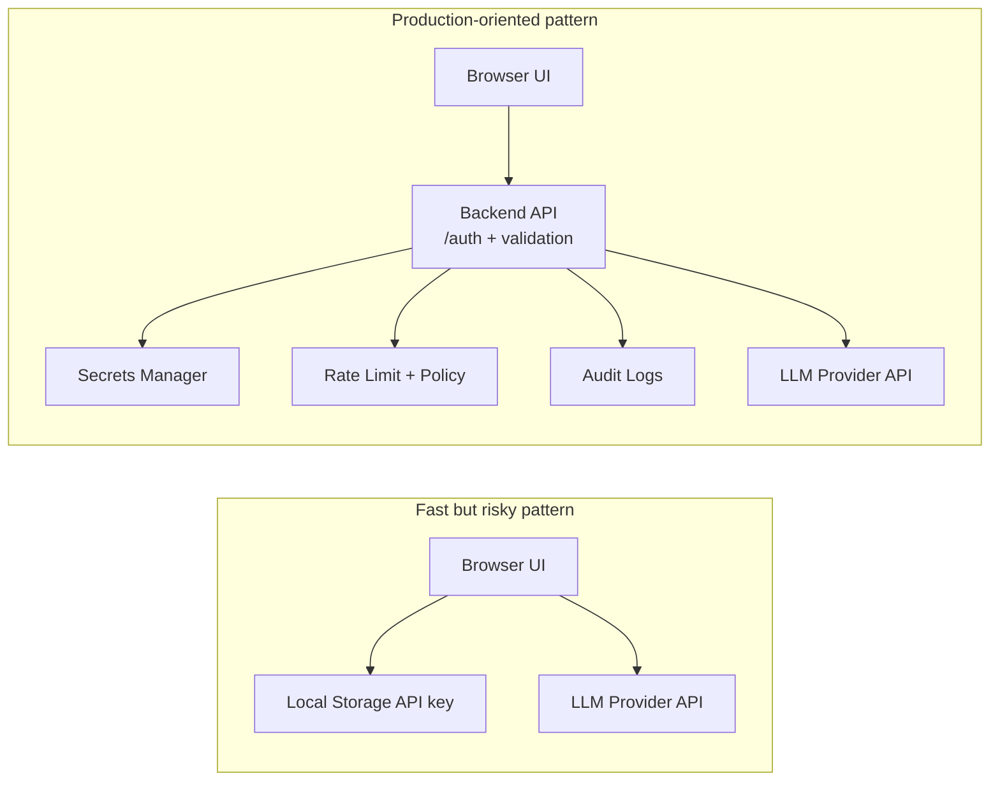
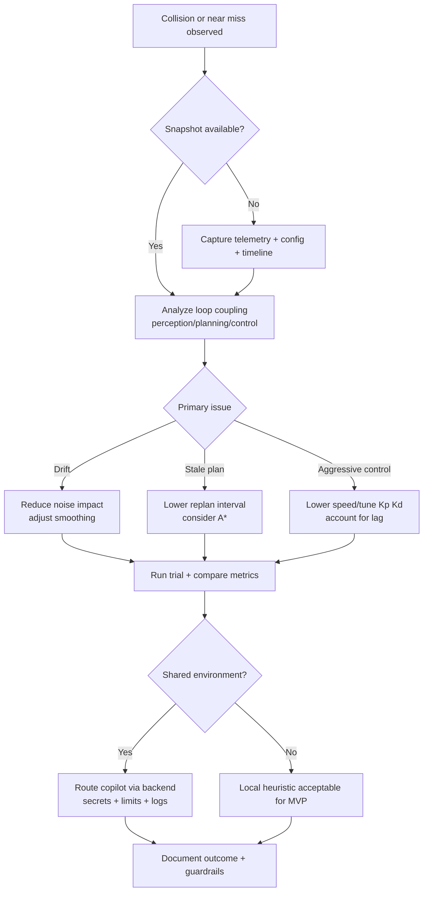

# Why Robots Crash: A Practical Guide to Perception, Planning, Control, and Secure AI Copilots

*A backend engineer's walkthrough of robot reliability and API security, based on the Robot Playground MVP.*

Tags: Robotics, Backend, API Security, Software Architecture, Engineering

---

Most robot failures are not caused by one broken module. They happen when multiple "mostly fine" modules interact under real conditions.

That is exactly what the Robot Playground MVP demonstrates. You can adjust sensor noise, planning strategy, replanning frequency, control gains, and actuator lag, then watch the robot behavior shift from stable to fragile. You can also ask a copilot, "Why did it collide?" and get parameter suggestions.

For backend and security-minded developers, this is more than robotics. It is a compact systems lesson:

- reliability depends on feedback loop quality
- observability must be end-to-end
- AI integration introduces trust boundaries you have to design intentionally

## The Core Loop: Perception -> Planning -> Control

At runtime, the robot repeatedly does three things:

1. estimate state from sensors
2. plan a route to goal
3. compute control commands to follow the route

The catch is that each stage is noisy, delayed, and dependent on the previous stage.

When engineers debug only one box at a time, they miss the interaction effects between boxes.

## What the MVP Makes Easy to See

The project exposes exactly the knobs that matter:

- **Perception**: perfect vs noisy sensors, configurable position noise, estimator smoothing
- **Planning**: A* grid or greedy repulsive planning, replanning every N ticks
- **Control**: heading PID or pure pursuit, max speed, Kp, Kd, actuator lag
- **Diagnostics**: tick-level explanation plus metrics like localization error, control effort, collisions

You are not guessing. You can observe why behavior changed.

## A Realistic Collision Scenario

A common failure sequence in the playground looks like this:

- noisy sensing creates estimate drift
- replanning is too infrequent
- planner output is valid for old state, not current reality
- controller sends aggressive turn commands to recover
- actuator lag delays response
- robot clips obstacle boundary and collision count increments

This is a systems failure, not a single bug.

This pattern should look familiar to backend engineers too. It is similar to stale caches plus delayed policy updates plus bursty execution causing user-visible failures.

## Why Planner Choice Alone Does Not Save You

It is tempting to frame this as "A* good, greedy bad." Reality is more nuanced.

- **A\*** can produce safer routes in clutter because it reasons globally on an occupancy grid.
- **Greedy + repulsion** can work well in easier scenes but may take risky local routes under tight geometry.

But both planners still depend on estimate quality and replan cadence. If estimate is wrong or update frequency is too low, route quality drops regardless of algorithm name.

The practical takeaway: tune the full loop before arguing about planner superiority.

## Control Layer: Where Good Plans Still Fail

In the MVP, heading control can be PID or pure pursuit. This is where many collisions become visible:

- high Kp can overcorrect heading error
- low damping (Kd too small) can increase oscillation
- high speed magnifies lateral error
- actuator lag makes command tracking late

A path can be mathematically valid while physically untrackable under your current control and dynamics settings.

For production systems, this is the same lesson as API timeouts and retries: policy can be correct on paper and still fail under latency and load.

## AI Copilot Integration: Useful, but Security-Critical

The MVP includes two diagnosis modes:

- local heuristic copilot (no external API)
- OpenAI-compatible API mode

This is excellent for experimentation, but it raises architecture and security questions quickly.

If a browser stores provider API keys and calls model endpoints directly, you gain speed but accept risk:

- key exposure through XSS or compromised client environment
- weaker centralized rate limiting and abuse controls
- inconsistent auditability
- unclear data handling for telemetry payloads

For personal local experiments, this can be acceptable. For shared internal tools, move to backend mediation.

## Spring/Java Backend Pattern for Safer Copilot Calls

If your stack is Java/Spring, a simple secure pattern is:

1. frontend sends collision snapshot to `POST /api/copilot/diagnose`
2. backend validates schema and size limits
3. backend removes or hashes sensitive fields
4. backend uses server-side secret to call model provider
5. backend returns bounded suggestions to client
6. client applies changes only after user confirmation

You can add:

- user/tenant-aware rate limits
- outbound allowlist for model provider domains
- structured audit logs (request id, model, latency, decision)
- fallback to local heuristic when provider is unavailable

This aligns with common API security practices and keeps blast radius smaller when something goes wrong.

## Common Engineering Mistakes

### 1) Overtuning one component

Teams spend time tuning PID while estimator drift is the root issue, or swapping planners while actuator lag is the limiter.

### 2) Ignoring plan freshness

A path can be valid at tick T and unsafe by T+N. Replan interval is a safety control, not just a performance knob.

### 3) Trusting AI suggestions blindly

Copilot output should be advisory. Always clamp ranges, validate keys, and preserve rollback paths.

### 4) Shipping convenience security to team environments

Browser-held API keys and direct provider calls are easy to start with and hard to unwind later.

## Practical Tuning + Security Checklist

Use this checklist before sharing your robotics tool with teammates:

- [ ] capture collision snapshots with recent telemetry window
- [ ] expose localization error and command saturation clearly
- [ ] set safe min/max bounds for every tunable parameter
- [ ] force replanning after applied suggestions
- [ ] keep LLM provider keys server-side in shared environments
- [ ] add API auth, authorization, and rate limiting
- [ ] log diagnosis requests with enough context for incident review

## Key Takeaways

- Robot reliability is an interaction problem across perception, planning, and control.
- Better diagnostics come from capturing the whole loop, not isolated metrics.
- AI copilots can accelerate debugging, but security architecture determines whether that acceleration is safe.
- For teams, backend-mediated model access is usually the right default.

The shortest version: tune the loop, not just a module. And treat AI integration as API design, not a UI shortcut.

